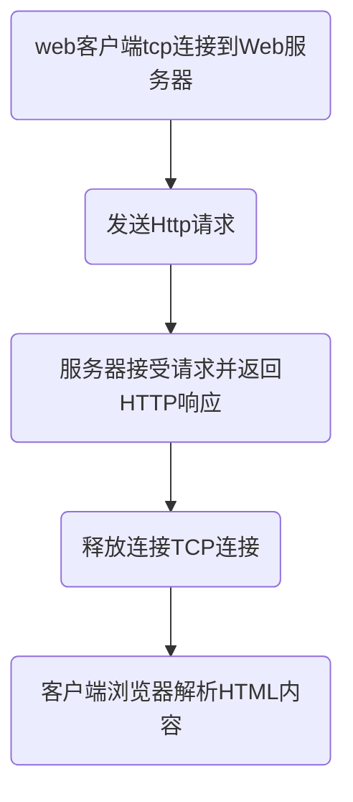

# http&https协议
参考博客：
* [HTTP和HTTPS协议，看一篇就够了](https://blog.csdn.net/xiaoming100001/article/details/81109617)

## 什么是http

超文本传输协议，是一个基于请求与响应，**无状态的**，应用层的协议，常基于TCP/IP协议传输数据，互联网上应用最为广泛的一种网络协议,所有的WWW文件都必须遵守这个标准。设计HTTP的初衷是为了提供一种发布和接收HTML页面的方法。

* **默认端口80， 如果 一台主机上有多个服务器呢?**
## http报文格式

http的请求报文由：请求行、首部、空行、主体四个部分组成。
其中请求行由请求方法字段、URL字段和HTTP协议版本字段3个字段组成，它们用空格分隔

## http通信流程

web客户端tcp连接到Web服务器->发送Http请求->服务器接受请求并返回HTTP响应->释放连接TCP连接->客户端浏览器解析HTML内容

## 什么是https

>图解HTTP》这本书中曾提过HTTPS是身披SSL外壳的HTTP。HTTPS是一种通过计算机网络进行安全通信的传输协议，**经由HTTP进行通信，利用SSL/TLS建立全信道，加密数据包**。**HTTPS使用的主要目的是提供对网站服务器的身份认证，同时保护交换数据的隐私与完整性**。PS:TLS是传输层加密协议，前身是SSL协议，由网景公司1995年发布，有时候两者不区分。

## 成本考虑

* SSL证书需要购买申请，功能越强大的证书费用越高
* SSL证书通常需要绑定IP，不能在同一IP上绑定多个域名，IPv4资源不可能支撑这个消耗（SSL有扩展可以部分解决这个问题，但是比较麻烦，而且要求浏览器、操作系统支持，Windows XP就不支持这个扩展，考虑到XP的装机量，这个特性几乎没用）。
* 根据ACM CoNEXT数据显示，使用HTTPS协议会使页面的加载时间延长近50%，增加10%到20%的耗电。
* HTTPS连接缓存不如HTTP高效，流量成本高。
* HTTPS连接服务器端资源占用高很多，支持访客多的网站需要投入更大的成本。
* HTTPS协议握手阶段比较费时，对网站的响应速度有影响，影响用户体验。比较好的方式是采用分而治之，类似12306网站的主页使用HTTP协议，有关于用户信息等方面使用HTTPS。
